# 
实验一：Linux常用命令的使用和shell编程

**樊昊天 2022201535**

## 1. 常用命令练习

- 1. 文件和目录操作
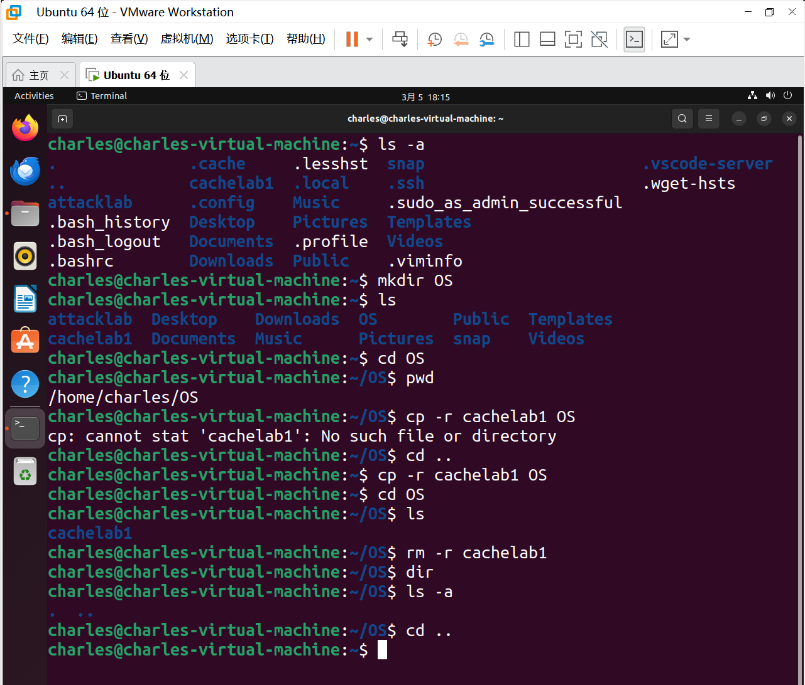
 

- 2. 文本处理
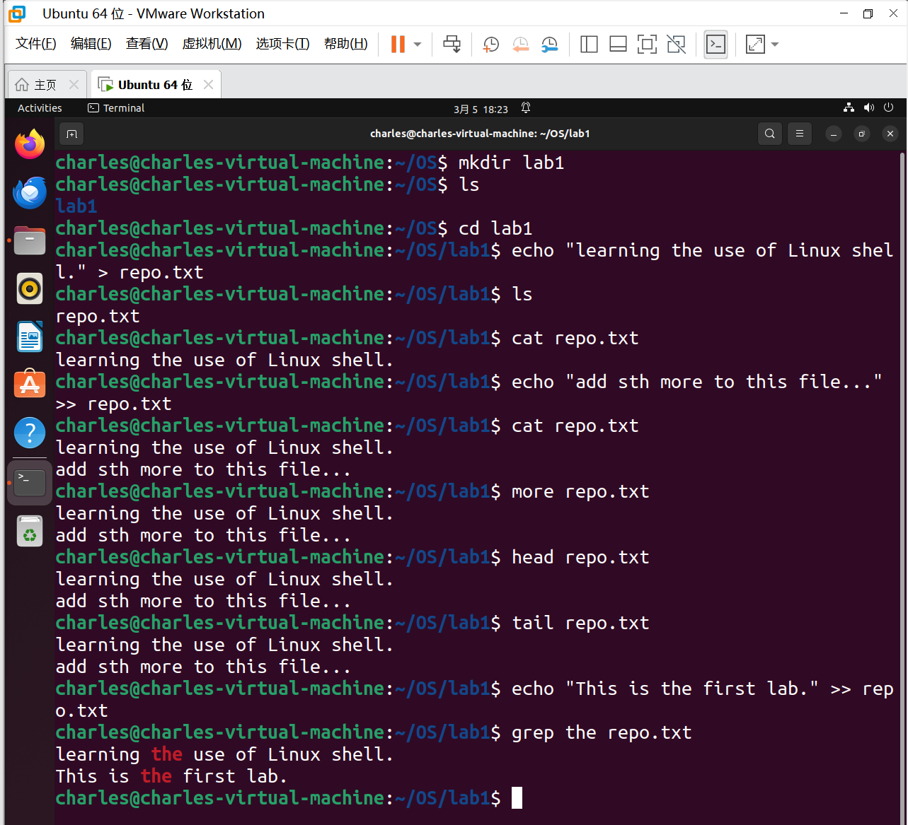
 

- 3. 系统信息与管理
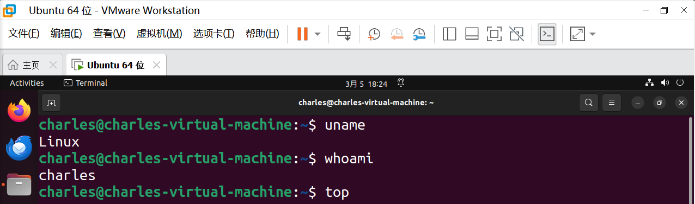
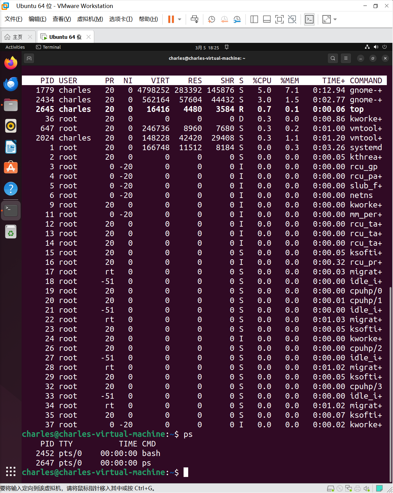
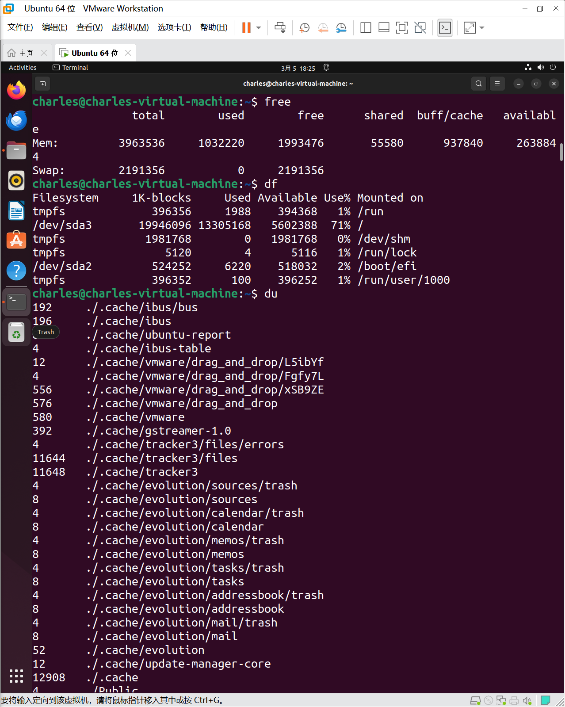
 

- 4. 网络相关
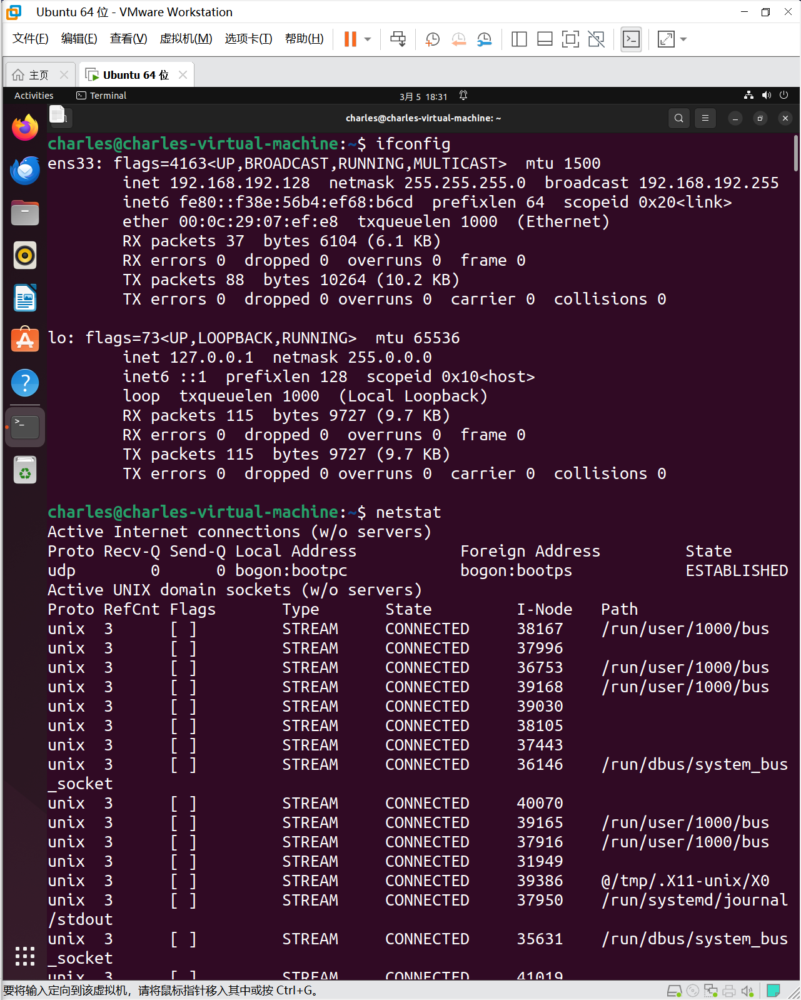
 

- 5. 权限管理
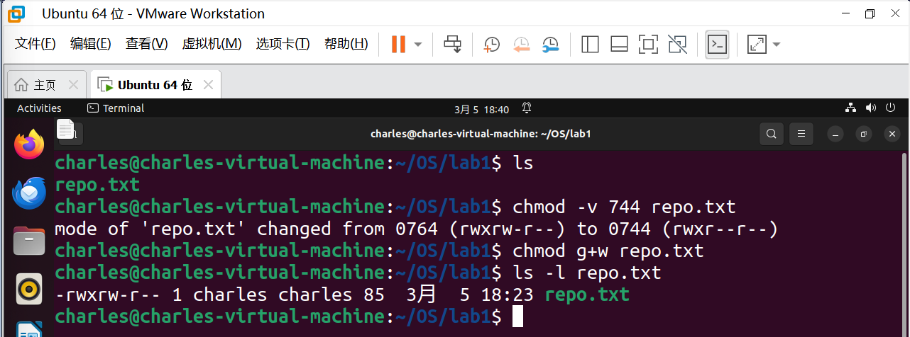
 

- 6. 程序执行控制
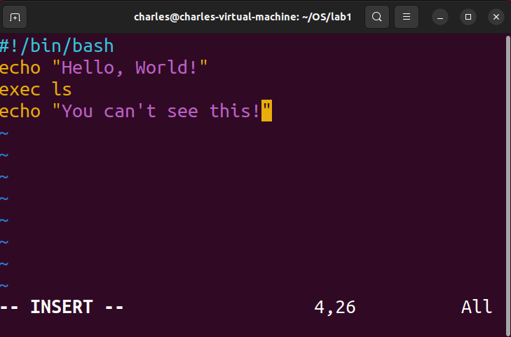
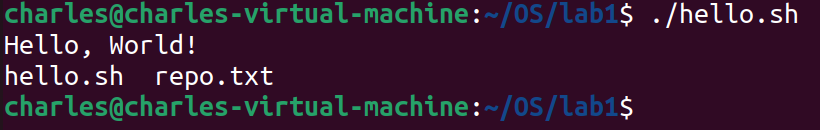
 

- 7. 帮助与手册查阅
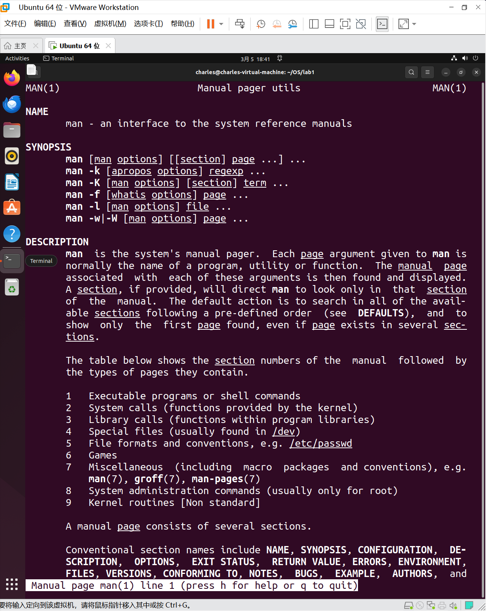
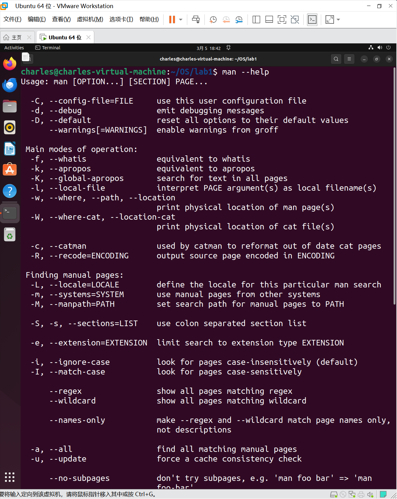
 

## 2. 编写并执行简单的Hello World脚本

- 1. 编写代码   
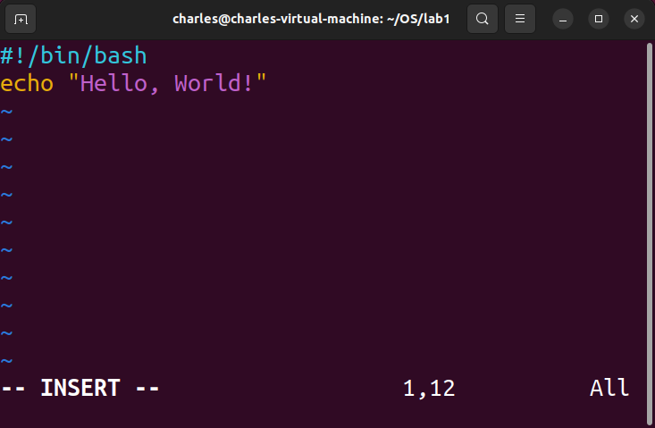
 

- 2. 运行结果
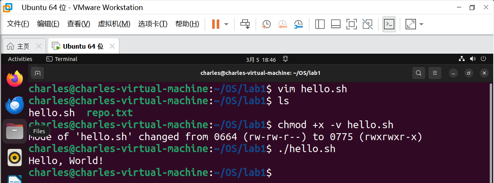