# <center>操作系统</center>

## 第三章 进程描述与控制

### 1. 操作系统管理应用程序的执行
- 使资源可供多个应用程序使用
- 处理器在多个应用程序之间切换，使所有应用程序看起来都在不断向前推进
- 处理器和I/O设备得以高效利用
**“不让处理器闲下来”**

### 2. 进程元素
- **程序代码** 
  - 可由执行同一个程序的多个其他进程分享
- **与该代码关联的一组数据**
  -  当处理器开始执行程序代码时，我们称该执行实体为*进程*
   
   
- **当程序运行时，可以通过一系列元素唯一地勾画与之相应的进程，包括：**
  

### 3. 进程控制块（PCB）
- 包含进程元素
- 一个运行中的进程有可能会被中断，之后又可以恢复执行，就好像中断未曾发生过一样
- 由OS创建和管理
- 实现多进程支持的关键工具  

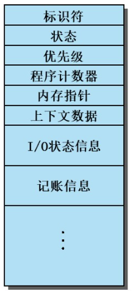   
*创建一个进程实际上是处理器给程序分配一个PCB（如果PCB还有空的/可用的）*

### 4. 进程状态
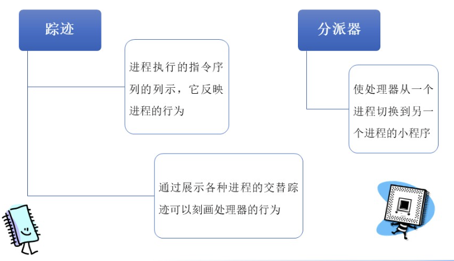   
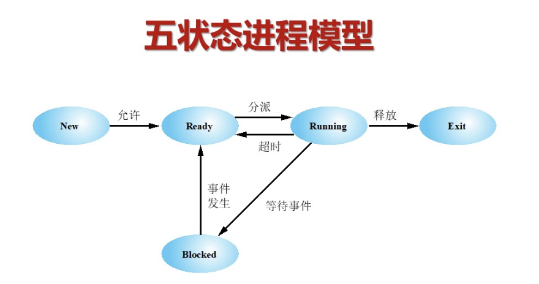   
多加一个挂起状态的话：  
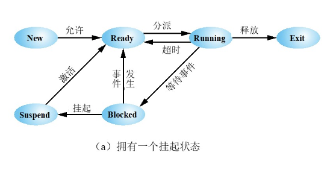   
两个挂起状态：
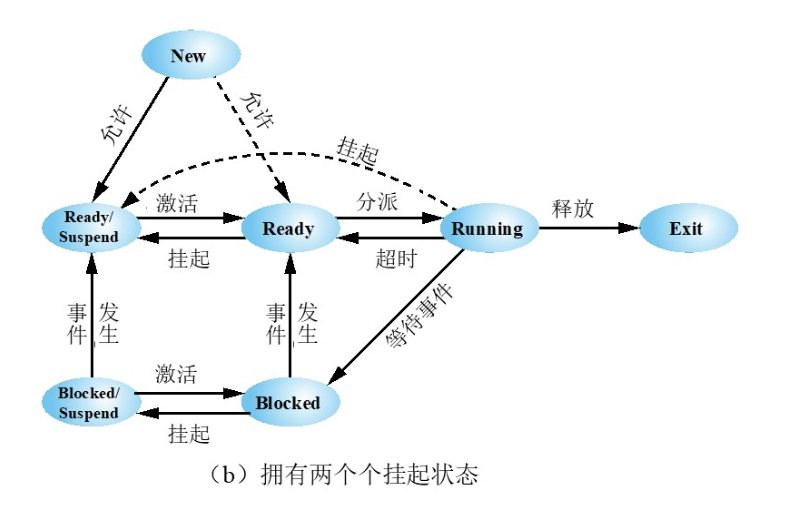   
- **被挂起进程的特点**
  - 该进程不可能立即被执行
  - 使进程进入挂起状态的实体：进程自己、父进程、OS，旨在防止它执行
  - 进程可能正在等待某个事件，也可能没有
  - 除非挂起它的实体明确发出解挂命令，否则不会离开挂起状态
<br>
- **进程状态的改变**

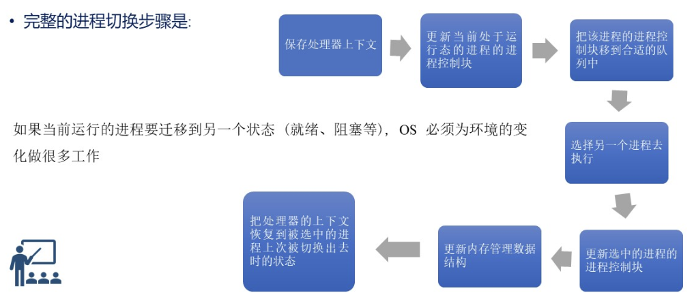

### 5. 进程创建
- 一旦OS决定创建新进程，它将:
  - 给进程分配一个唯一的进程标识符（PID）
  - 给进程分配空间
  - 初始化进程控制块（PCB）
  - 设置合适的链接
  - 创建或扩展其他数据结构

### 6. 系统中断

#### 中断（外中断）
- 由独立于当前运行的进程的某种外部事件引起的
  - 时钟中断
  - I/O中断
  - 内存出错
- 时间片
  - 一个进程被中断前能享用的最长执行时间
   
#### 陷入（内中断）
- 有当前运行的进程内部产生的出错或异常条件
- OS确定该条件是否致命
  - 当前进程迁移到退出状态，进程切换发生
  - 所采取的行动取决于出错的本质
   
- [ ] 填完表格
  
| 机制 | 致因 | 用途 |
| :--- | :--- | :---|
| 中断 | 信号来源CPU外部，与当前执行指令无关 | 响应外部异步事件 |

### 7. 操作系统的执行
- 操作系统与用户进程的关系

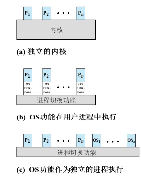
<br>
- OS在用户空间中运行

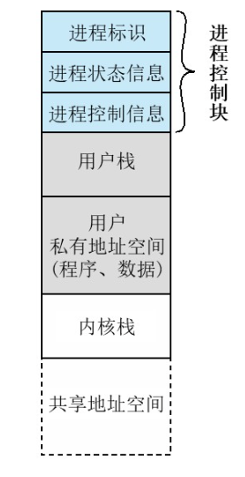


## 第四章 线程

### 1. 进程特性划分及线程的诞生

- 分派单位称为**线程**或**轻量级进程**
- 资源拥有单位称为**进程**或**任务**
> 传统进程机制中，进程是资源分配、调度的基本单位。
> 引入线程后，进程是资源分配的基本单位（它拥有这些资源），线程是**调度**的基本单位。
> “线程”是进程实体划分出来的又一实体，它不能脱离进程独立存在。
> 

- **多线程处理**――操作系统在一个进程内支持多条、并发的执行路径的能力
> 引入线程后，除了进程间，各线程间也能并发，提升了并发度

#### 单线程方法
- 每个进程拥有单个执行线程，实际上没有线程的概念
- MS-DOS是一个例子

#### 多线程方法
- 一个进程含有多个线程，如Java的运行时环境

#### 一个进程中的一个或多个进程
##### 每个线程拥有：
- 一个执行状态（运行、就绪等）
- 不运行时被保存的线程上下文
- 一个执行栈
- 局部变量的静态存储
- 对它的进程的内存和资源的访问（一个进程的所有线程共享它们）
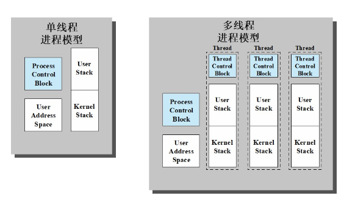

### 2. 线程的好处
- 创建新线程比进程耗时少
- 终止一个线程比进程耗时少
- 线程间切换比进程间切换耗时少
> 开销小，内存空间并没有切换
- 线程提升程序间通信的有效性

### 3. 单用户系统中的线程应用
- 前台和后台工作
- 异步处理
- 执行速度
- 模块化程序结构

### 4. 线程的执行状态
- 在支持线程的OS中，以线程为基础进行调度和分派；与执行相关的大多数状态信息在线程级数据结构中维护
  - 挂起一个进程涉及到挂起该进程的所有线程
  - 终止一个进程将终止该进程中的所有线程
- 线程的关键状态：**运行、就绪、阻塞**
- 引起线程状态变化的线程操作：创建进程、阻塞、唤醒、完成

> 利用线程实现RPC：
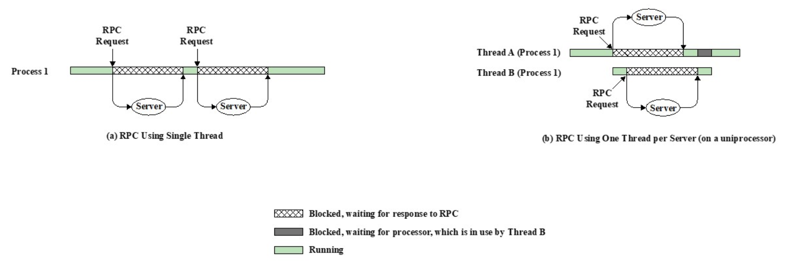
>
> 单处理器上的多线程处理：
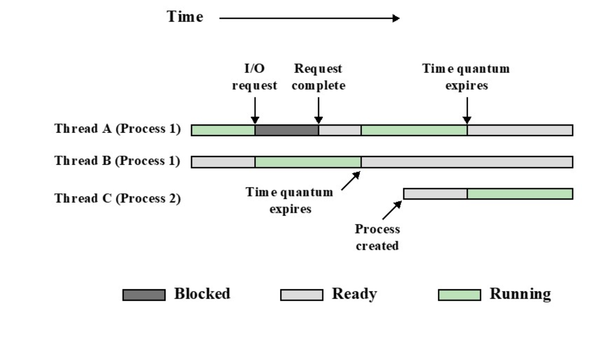

### 5. 线程同步
- 一个进程中的多个线程的活动有必要进行同步，因为：
  - 一个进程的所有线程共享相同的地址空间和其他资源
  - 一个线程对资源的任何改动都会影响一个进程中的其他线程

### 6. 线程的类型
#### 用户级线程（ULT）
- 程序员创建的线程，由应用程序通过线程库实现，**内核不知其存在**
- 线程的**所有管理**都由**应用程序负责**（包括线程切换）
- **线程切换**可以在**用户态下即可完成**，无需OS干预
  

- 优点
  - **线程切换不需要内核态特权**
  - 可以根据应用的特点进行调度
- 缺点
  - 在常见的OS中，很懂系统调用会引起阻塞
    - 当一个ULT执行系统调用时，不但该线程被阻塞，它所在进程的所有线程都被阻塞
  - 在纯ULT方案中，多线程无法利用多处理系统的优势
- 缺点的克服
  - Jacketing：把阻塞式的系统调用转换成非阻塞式的系统调用
  - 用多进程应用代替多线程应用

#### 内核级线程（KLT）
- 由内核进行线程管理，应用程序不进行线程管理
  > Windows是这类系统的例子
- **线程切换**必须在**内核态**才能完成
  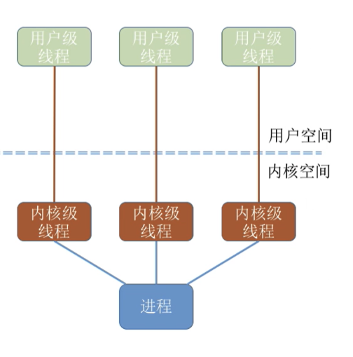
- 优点
  - 内核可以在多处理器上同时对一个进程中的多个线程进行调度
  - 如果某进程的一个线程被阻塞，内核可调度该进程中的其他线程运行
  - 内核例程可以安多线程方式工作
- 缺点
  - 创建线程的开销大
  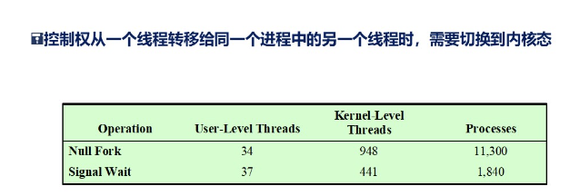

#### 组合方案
- 在同时支持ULT和KLT的系统
- 中，可将二者组合：将n个ULT映射到m个KLT上（n>=m）
- 操作系统值看得见KLT，因此只有内核级线程才是**处理机分配的单位**
  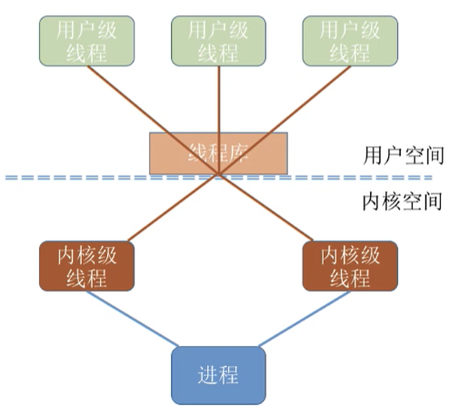
  > 上图模型中，该进程由两个KLT、三个ULT组成，但在用户看来，这个进程中有三个线程。但即使该进程在一个4核处理机的计算机上运行，也最多只能被分配到两个核，最多只能被分配到两个核，最多只能由两个用户线程并行执行。

### 7. Linux中的“线程”

## 第五章 并发：互斥与同步

### 1. 并发问题的产生

#### 历史顺序来看
- 多道程序处理：单处理器环境下对多个进程的管理
- 多进程处理：多处理器环境下对多个进程的管理
- 分布式进程处理：多台计算机对多个进程的管理

#### 产生情景来看
- 多个应用：在多个活跃的应用之间共享处理时间
- 结构化应用：一个应用可以设计成多个并发进程的集合
- 操作系统结构：操作系统本身包含多个进程或线程

### 2. 并发的原理
- 交替和重叠
  - 可看作并发处理的例子
  - 二者呈现同样的问题
- 单处理器――进程执行的相对速度难以预测，它依赖于：
  - 其他进程的活动
  - OS处理中断的方式
  - OS的调度策略

### 3. 并发的难点
- 全局资源的共享
- OS很难以最佳方式管理资源的分配
- 很难定义程序设计错误，因为结果难以确定、复现
  
#### 竞争条件


### 4. 互斥
 *一个进程进入临界区，其他进程就无法进入该临界区*
 *一个进程访问某临界进程时，另一个想要访问该临界资源的进程必须等待*
#### 互斥的需求
 - 必须实施
 - 没有饥饿或死锁
 - 一个进程在临界区外死亡不能干扰其他进程
 - 没有其他进程使用临界区时，不能拒绝让一个进程进入临界区
 - 对进程的相对速度和进程数量不能有任何假设（要求）
 - 一个进程只能在临界区停留有限的时间
<br>

#### 硬件支持
##### 屏蔽中断
- 适用于单处理器系统
- 缺点：
  - 执行效率会明显下降
  - 在多处理器体系结构中不起作用

##### 特殊指令
- "compare_and_swap"指令
  - 理解为“比较和更新”比较好
  - 将一个内存值与测试值比较
  - 如果比较结果相同，则把内存**更新**为一个指定的值
  - 返回**原来的**内存值
  - 以**原子方式**执行
  
  ```cpp
  int compare_and_swap(int *word, int testval, int newval){
    int oldval;
    oldval = *word;
    if (oldval == testval)
      *word = newval;
    return oldval;
  }
  ```

#### 利用信号量解决无限缓冲区生产者/消费者问题
[信号量解决无限缓冲区](https://blog.csdn.net/singxsy/article/details/109696792?ops_request_misc=&request_id=&biz_id=102&utm_term=%E6%93%8D%E4%BD%9C%E7%B3%BB%E7%BB%9F%20%E4%BF%A1%E5%8F%B7%E9%87%8F%20%E6%97%A0%E9%99%90%E7%BC%93%E5%86%B2%E5%8C%BA&utm_medium=distribute.pc_search_result.none-task-blog-2~all~sobaiduweb~default-0-109696792.142^v99^pc_search_result_base8&spm=1018.2226.3001.4187)


