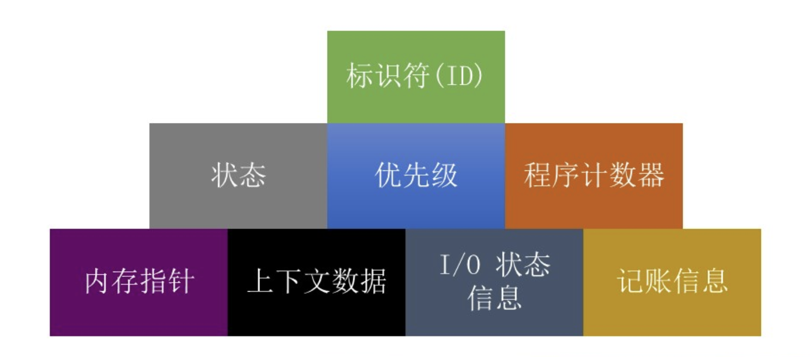

# 
操作系统

## 第三章 进程描述与控制

### 1. 操作系统管理应用程序的执行
- 使资源可供多个应用程序使用
- 处理器在多个应用程序之间切换，使所有应用程序看起来都在不断向前推进
- 处理器和I/O设备得以高效利用
**“不让处理器闲下来”**

### 2. 进程元素
- **程序代码** 
  - 可由执行同一个程序的多个其他进程分享
- **与该代码关联的一组数据**
  -  当处理器开始执行程序代码时，我们称该执行实体为*进程*
   
   
- **当程序运行时，可以通过一系列元素唯一地勾画与之相应的进程，包括：**
  

### 3. 进程控制块（PCB）
- 包含进程元素
- 一个运行中的进程有可能会被中断，之后又可以恢复执行，就好像中断未曾发生过一样
- 由OS创建和管理
- 实现多进程支持的关键工具  

   
*创建一个进程实际上是处理器给程序分配一个PCB（如果PCB还有空的/可用的）*

### 4. 进程状态
   
   
多加一个挂起状态的话：  
   
两个挂起状态：
   
- **被挂起进程的特点**
  - 该进程不可能立即被执行
  - 使进程进入挂起状态的实体：进程自己、父进程、OS，旨在防止它执行
  - 进程可能正在等待某个事件，也可能没有
  - 除非挂起它的实体明确发出解挂命令，否则不会离开挂起状态
 
- **进程状态的改变**

### 5. 进程创建
- 一旦OS决定创建新进程，它将:
  - 给进程分配一个唯一的进程标识符（PID）
  - 给进程分配空间
  - 初始化进程控制块（PCB）
  - 设置合适的链接
  - 创建或扩展其他数据结构

### 6. 系统中断

#### 中断（外中断）
- 由独立于当前运行的进程的某种外部事件引起的
  - 时钟中断
  - I/O中断
  - 内存出错
- 时间片
  - 一个进程被中断前能享用的最长执行时间
   
#### 陷入（内中断）
- 有当前运行的进程内部产生的出错或异常条件
- OS确定该条件是否致命
  - 当前进程迁移到退出状态，进程切换发生
  - 所采取的行动取决于出错的本质
   
- [ ] 填完表格
  
| 机制 | 致因 | 用途 |
| :--- | :--- | :---|
| 中断 | 信号来源CPU外部，与当前执行指令无关 | 响应外部异步事件 |

### 7. 操作系统的执行
- 操作系统与用户进程的关系

 
- OS在用户空间中运行

